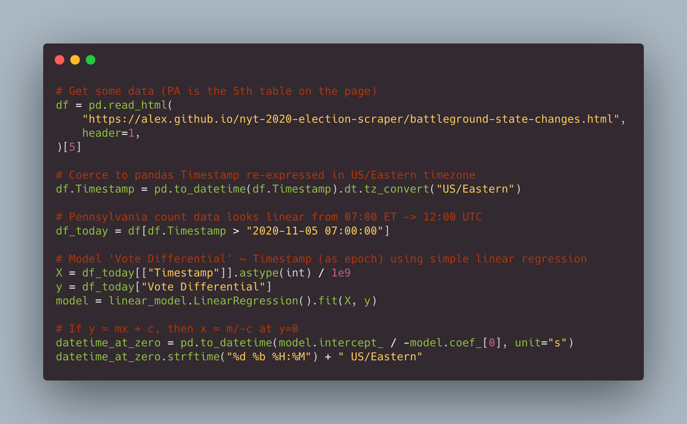

# NYT Estimated Votes Remaining

> Instead of compulsively checking https://alex.github.io/nyt-2020-election-scraper/battleground-state-changes.html in just 8 lines of pandas you can scrape, clean and fit a wildly oversimplistic linear model to the data as it rolls in from NYT...and set an alarm. ⏰

## Some irresponsibly simplistic linear forecasts
1. If Pennsylvania keeps counting and doesn't stop, they'll hit zero vote differential around 9am ET.
2. For Georgia it should be before 5am ET.
3. Arizona could be a while.
4. Nevada ¯\\\_(ツ)\_/¯

